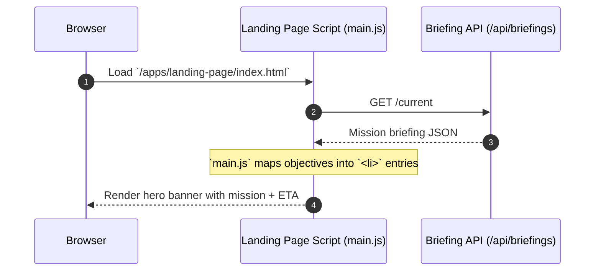
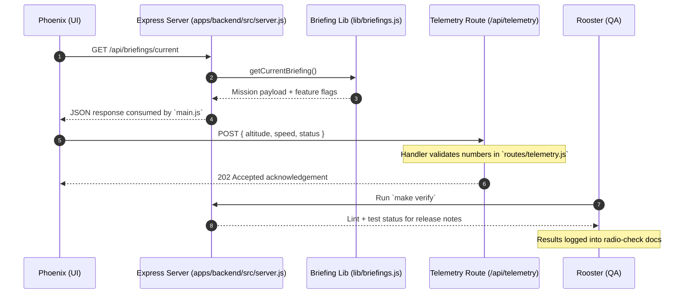
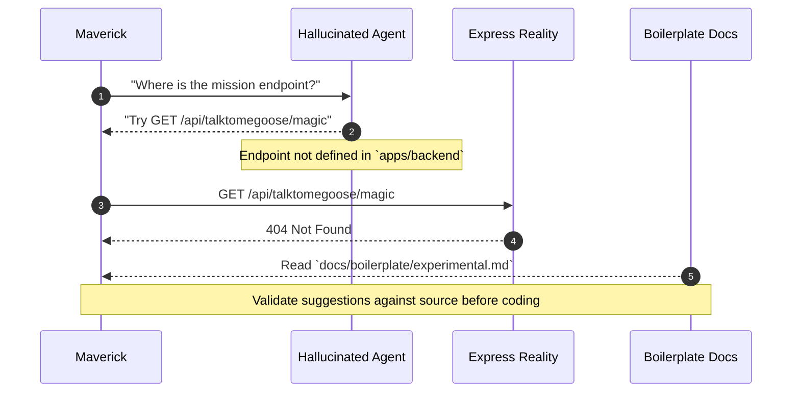

# Boilerplate Sequence Diagrams

Mermaid sequence diagrams showing how the optional boilerplate pieces collaborate. Each edition references the Express backend in `apps/backend` and the static landing page assets in `apps/landing-page`.

## Simple Edition

## Advanced Edition

## Hallucinated Edition

