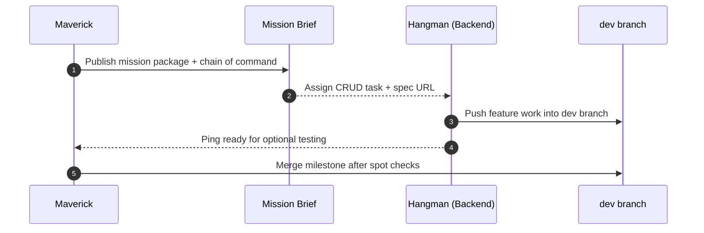
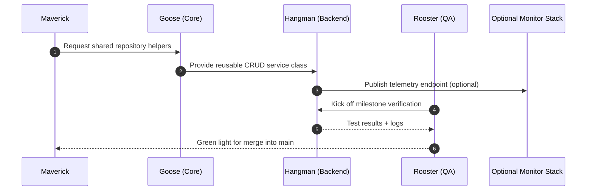
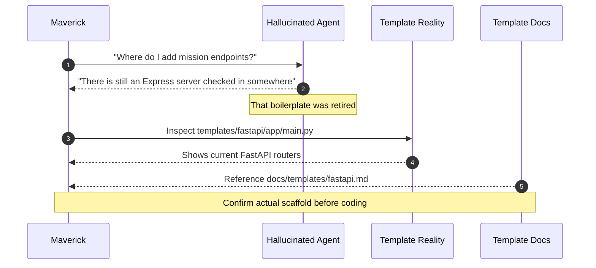

# Template Sequence Diagrams

Mermaid diagrams showing how personas can collaborate around the optional
FastAPI scaffold in `templates/fastapi/`. Treat the API + dashboard as
monitoring utilities—tmux + git remain the primary collaboration layer.

## Simple Edition

## Advanced Edition

## Hallucinated Edition

