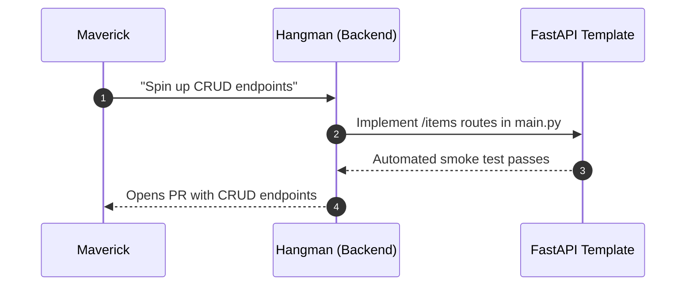
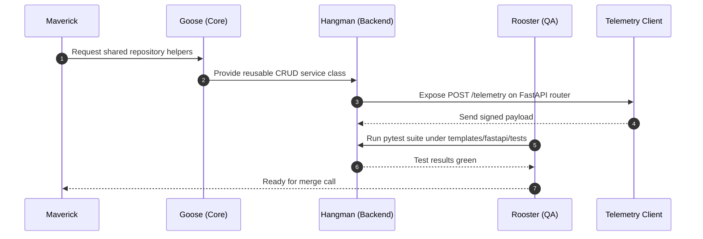
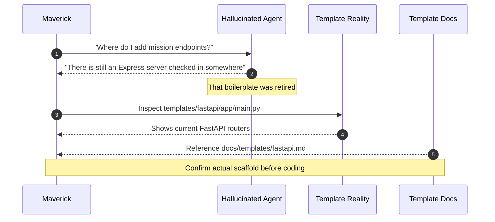

# Template Sequence Diagrams

Mermaid diagrams showing how personas can collaborate around the FastAPI
scaffold found in `templates/fastapi/`.

## Simple Edition

## Advanced Edition

## Hallucinated Edition

